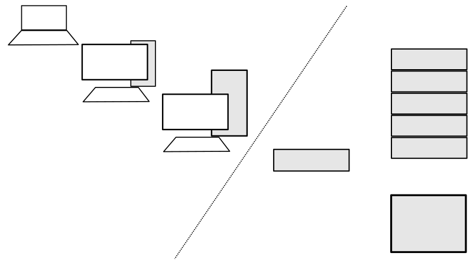

```{r setup, include=FALSE}
knitr::opts_chunk$set(echo = FALSE)
```

## What is HPC

* What is High Performance?
* Why do you care?

## Definitions

* i/o (aka Input/Output): Reading and Writing from Disk
* parallel: Doing things at the same time
* CPU: The calculator
    * Cores: Physical Number of Calculators
    * Threads: Number of lines Cores can service
* memory(RAM): The place the computer puts things it's currently working on
* storage: The place you put things you want to keep
* node: a single computer

## All about Approach

1. Write a solution to a problem
2. Look for things in series that could be done in parallel (Independence Test)
3. Split into function
4. Iterate function in parallel
5. Collate the answers (if necessary)

## Keep it Simple

* map + reduce, split + combine, independant + aggregate

**High end stuff**

* Hadoop
* Spark
* MPI (Message Passing Interface)
* Microservices (e.g. AWS Lambda)

## Profiling

Finding the limiting factor:

* RAM
    * Expensive
* CPU - more is great but:
    * slower clock speed
    * RAM per CPU
* Disk
    * Fast or Big, local or network?

You have to find the limit to figure out how to go faster.

* System Monitor
* Logging in code (including node name, time stamp and memory usage)
* Code profiling tools (memory management)

## Hardware


## Hardware (Text)


*Simple/Slower*

* Laptop
* Desktop
* Server
* Bunch of Servers
* Cluster or Cloud

*Complex/Faster*


## What's Available

* College or Reserch Clusters
     * CAES [Farm](https://wiki.cse.ucdavis.edu/support/home)
     * etc...
* [Amazon Web Services], e.g. [Lambda](https://aws.amazon.com/lambda/features/)
* Google Compute Engine
* Microsoft Azure

## Part 2: Examples

* [Make things independant](https://bitbucket.org/hijmans-lab/computing/src/master/)
* [Do things at the same time](https://github.com/wildintellect/lenscorrection)

## Geo Problems

* Calculate answer by geography where neighbors don't matter
   * By Country, State, County, City, etc...
   * By Pixel, Stack of Pixels, Neighborhoods of Pixels
* Do the same thing over many files
   * Batch reprojection & format conversion

## Geo Examples

Sorry, more not quite public code yet.

* [Moving to something bigger](https://bitbucket.org/hijmans-lab/gfc-data/src/master/scripts/1_prepareData.R)
* [Batch Conversion R](https://bitbucket.org/hijmans-lab/gfc-data/src/master/scripts/dataprep/wc2compress.R)
* [Batch Conversion BASH](https://bitbucket.org/hijmans-lab/gfc-data/src/master/scripts/dataprep/worldclim_fut.sh)


## Geo Problems that don't parallel easily

* Where your value depends on your neighbor's value
    * e.g. Interpolation
* Data can't be split into subsets (sum of parts != sum of whole)
* Edge effects
* Distance Matrix (at least if you want to avoid duplication of effort)

## Tips

* Think about minimal data loading
* Think about memory management (unload unused data and results)
* You may need to run in parts, verify success before moving on
* Use version control on code
* Keep code and data in separate places

## Rabbit holes

Remember Keep it Simple

* Some libraries and packages have parallelization included but optional (on a single node)
    * example R raster (some functions), requires declaring thread/core pool
* Mac/Linux differ from Windows (doesn't support threading the same way)
* Thread Safety - One thread crashing can ruin all the others (unless thread safe)