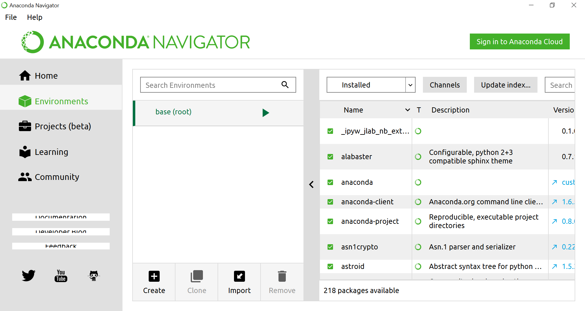
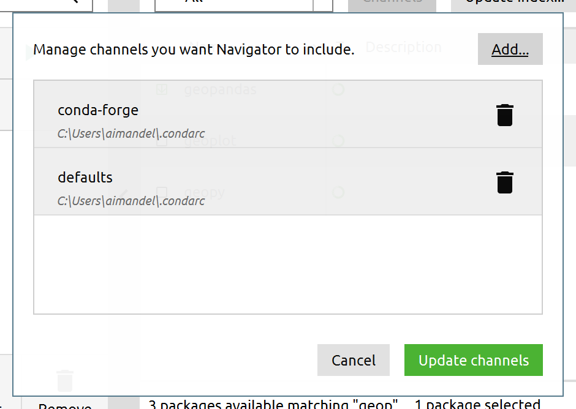
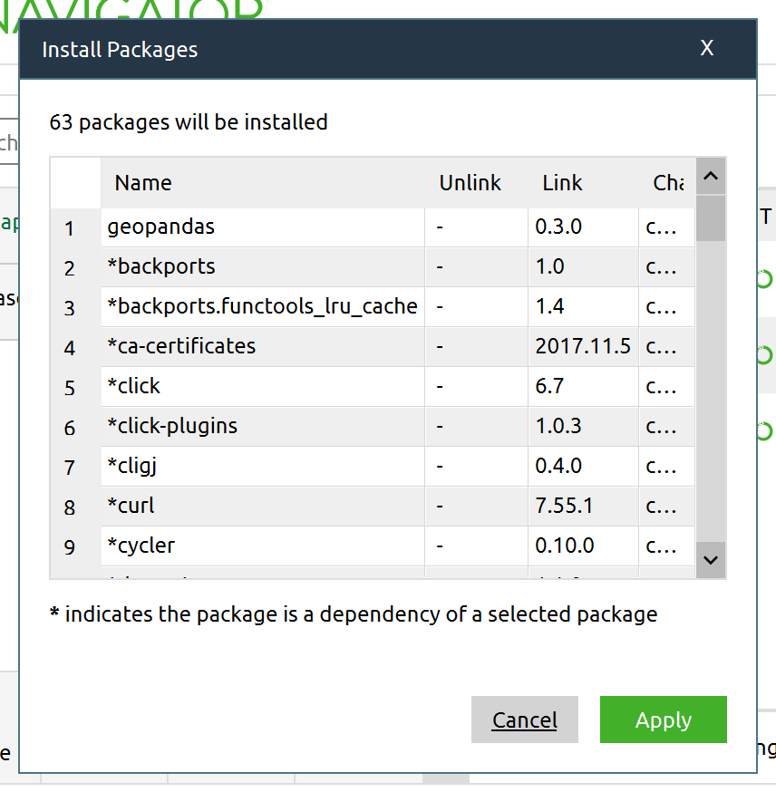

# PythonForGeospatial

Travis O'Brien
For the main workshop go https://bitbucket.org/taobrienlbl/maptimedavis

## Installation Instructions

1. Download and Install the [Anaconda Python Distribution](https://www.anaconda.com/).
1. Open either the Anaconda Prompt/Terminal OR Anaconda Navigator(GUI)

### Anaconda Navigator Method
1. Open the Anaconda Navigator application
1. Select Environments (on the left) 
1. Pick the base (root) or root environment
1. In the right side pane click the **Channels** button
1. Add ```conda-forge``` and then select **Update Channels** 
1. Change the 1st menu on the left **Installed** to **Not installed** OR **All**
1. In the search box on the right side type in ```geopandas```
1. In the main section select the check box on the left of the geopandas package.
1. In the bottom right select the **Apply** button.
1. Accept the suggested upgrades. 
1. When it's done, switch back to **Home** (upper left), and you can now launch Jupyter Notebook or Spyder code editor.

### Anaconda Prompt/Terminal Method
1. Open the Anaconda Prompt OR Terminal (Mac/Linux advanced users)
    1. Anaconda Prompt
    ```conda install -c conda-forge geopandas```
    1. Terminal
        1. Activate the conda environment, run the command listed above
    1. Say yes to prompts about upgrading packages
1. Once done installing you should be able to run ```jupyter-notebook``` or ```spyder`` to edit and run code.

## Now your ready for the main workshop

Open https://bitbucket.org/taobrienlbl/maptimedavis in your web browser to see the instructions and get the files.