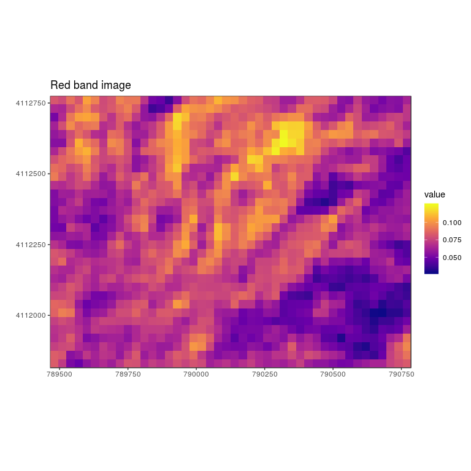
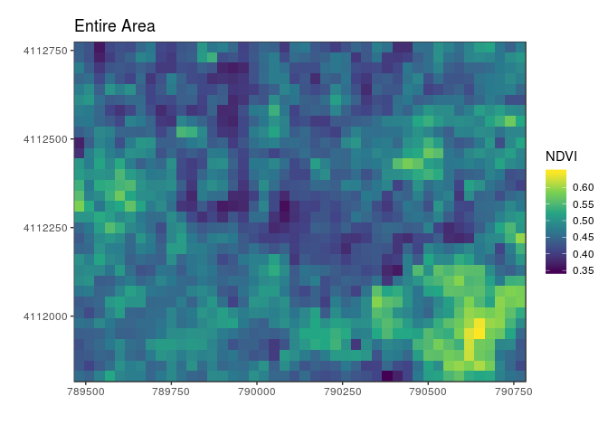
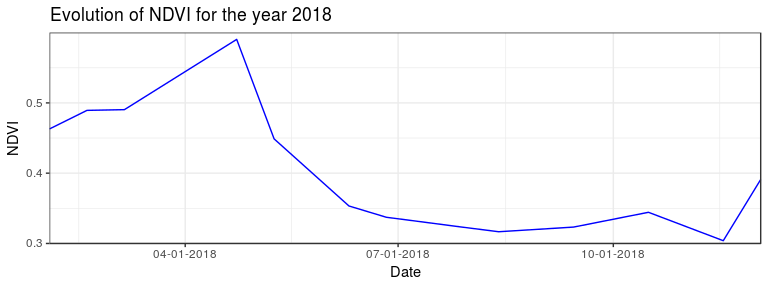

-   [Introduction](#introduction)
-   [Landsat Image](#landsat-image)
    -   [Why landsat images](#why-landsat-images)
    -   [Downloading Landsat images](#downloading-landsat-images)
    -   [Download Landsat Images](#download-landsat-images)
-   [Method](#method)
-   [Pertinent tools and functions](#pertinent-tools-and-functions)
    -   [Loading libraries](#loading-libraries)
    -   [Custumized functions](#custumized-functions)
-   [Tutoral 1: A single multiband raster
    image](#tutoral-1-a-single-multiband-raster-image)
    -   [Loading and visualizing](#loading-and-visualizing)
    -   [Getting stacked rasters](#getting-stacked-rasters)
    -   [Visualizing rasters](#visualizing-rasters)
    -   [NDVI Calculation example](#ndvi-calculation-example)
-   [Tutorial 2: Temporal Analysis](#tutorial-2-temporal-analysis)
    -   [Loading series of rasters and calculating
        NDVI](#loading-series-of-rasters-and-calculating-ndvi)
    -   [Loading NDVI time series](#loading-ndvi-time-series)
    -   [Visualizing temporal dynamics](#visualizing-temporal-dynamics)
-   [Tutorial 3: Spatial Analysis](#tutorial-3-spatial-analysis)
    -   [Information about location](#information-about-location)
    -   [Croping extent](#croping-extent)
    -   [Visualizing spatial dynamics](#visualizing-spatial-dynamics)

Introduction
============

In order to quantify live vegetation within any area, an indicator,
which uses the visible and near-infrared bands of the electromagnetic
spectrum called the Normalized Difference Vegetation Index (NDVI), has
been popularized for a wide variety of projects after the invent of
remote sensing measurements

Until now, such index has been derived using spatial analysis of GIS
packages especially at a specific site and time. Moreover, such has been
done manually. In addition, such information gathering over different
time scales are not also available yet. In this regard, this workshop
presents how NDVI can be derived using open source codes related to
R-spatial packages. Further, this exercise demonstrates how such
information can automatically be derived and extracts in a time series
format. It will also presents an exercise to discretize the raster map
under different spatial resolution revealing evolution of NDVI
distribution over the given location.

While NDVI information is very useful in various field of studies like
agriculture, crop yield, types of vegetation, plant phenology, climate
change, seasonal change and beyond, this workshop has been set up with
following objectives:

-   to learn how to deal with remotely sensed images to extract physical
    quantities like NDVI
-   to visualize rater image and relevant statistics
-   to perform sample raster calculation
-   to extract NDVI time series from deifferent periods of obesevation
-   to visualize spatial dynamics

Landsat Image
=============

Why landsat images
------------------

Since 1972 the Landsat Mission has been collecting imagery of earth.
This archive of data is free to access and provides researchers with an
invaluable resource of continuous coverage for their study areas.
Currently, Landsat 7 and Landsat 8 are in orbit and have a repeat
interval of 16 days. The satellites’ orbits are offset to allow 8-day
repeat coverage of any Landsat scene.

Downloading Landsat images
--------------------------

-   Go to www.earthexplorer.usgs.gov
-   If you do not have earth explorar account, register for an account,
    certain features are accessible without an account, but to download
    data an account is necessary.
-   Enter search criteria to define your area and dates of interest; if
    using a shapefile, the data must be uploaded as a \*.zip
-   Under datasets you can choose which imagery archives to search
    through; note that earth explorer hosts more than just Landsat data.
-   Under the Landsat collection, you can choose which Landsat
    satellites you want to add to your search and which level of data
    processing you want for the imagery products. For this tutorial we
    used Collection 1 Level-2, Landsat 8 data. Level 2 imagery is
    processed to surface reflectance.
-   Under additional criteria you can further refine your search
    parameters. One example is to set limits on the amount of cloud
    cover you want to allow in any scene
-   Run the search by hitting the results button. This returns a set of
    images that meet your criteria. For each image you can view its
    metadata and display the footprint of the image tile over your area
    of interest.
-   Depending on which type of imagery you want to access, the download
    options will change. Landsat Collection-1 Level 2 data is generated
    on demand and must submitted as an order to USGS. You will receive
    an email when your imagery request has been fulfilled and is ready
    to download. If you are using the Landsat ARD (analysis ready data)
    Collection, this imagery is immediately available for download and
    can be downloaded individually or with the bulk download option.
-   Once you know which Landsat scenes you want to download there are
    other options you can explore to speed up the process. See:
    github.com/USGS-EROS/espa-bulk-downloader

Download Landsat Images
-----------------------

For this workshop, we have already downloaded Landsat image and stored
in `google drive`. Before the workshop make sure that all the files are
under `Data` folder and also note that all the image files named with
"YYYYMMDD.tif" format

Method
======

Here, we mostly use R-studio interface except for downloading landsat
imagary files. Our purpose is to use simple and widly used open source
library as much as possible. This workshop, entirely, will be done using
R-Markdown because R Markdown documents are fully reproducible.
Moreover, it allows you to see narrative text and code and preview on
table and figures in an elegantly formatted version. It also allows us
to save in `html` or `pdf` format. To learn more about `R Markdown`,
refer to <https://rmarkdown.rstudio.com/>

Our area of interest covers part of the San Joaquin Experimental Range
which is located in the foothills of the Sierra Nevada in Coarsegold,
Madera County, about 20 miles north of Fresno. San Joaquin contains open
woodland dominated by oaks (blue and interior live oaks) and digger pine
with scattered shrubs and nearly continuous cover of herbaceous plants.

This workshop covers: (a) import the raster data; (b) visualization; (c)
raster calculation and (d) temporal and spatial dynamics.

Pertinent tools and functions
=============================

Loading libraries
-----------------

    library(raster)
    library(sp)
    library(rgdal)
    library(ggplot2)
    library(ggpubr)
    library(scales)

Custumized functions
--------------------

Here are some functions for this workshop and later you can use freely.
These functions are developed by us to make ease of analysis. In the
second part of workshop, we will use these function intensively.

    NDVI <- function(X, Y){
      # generates raster of given two bands
      #X: Near infrared band Image
      #Y: Red band Image
      ndvi <- (X-Y)/(X+Y)
      return(ndvi)
    }

    ggrasterPlot <- function(imgRaster, valueStr, titleStr, colorScheme =  'inferno'){
      # routine to create raster plot using ggplot with required modifications
      #imgRaster:   raster image
      #valueStr:    define value to be analyzed
      #titleStr:    set of strings for title
      #colorScheme: color of image 
      imgRaster.df <- as.data.frame(imgRaster, xy = TRUE)
      colnames(imgRaster.df)<-c('x', 'y', valueStr)
      pltRaster<-ggplot(imgRaster.df, aes(x = x, y = y)) +
        geom_raster(data = imgRaster.df , aes_string(fill = valueStr)) +
        scale_fill_viridis_c(option = colorScheme) +
        scale_x_continuous(expand = c(0,0))+
        scale_y_continuous(expand = c(0,0))+
        xlab('') + ylab('')+
        coord_quickmap()+
        ggtitle(titleStr)+
      theme_bw()
      return(pltRaster)
    }

    ggrasterHist<- function(imgRaster, valueStr){
      # routine to create histogram of raster using ggplot with required modifications
      #imgRaster:   raster image
      #valueStr:    define value to be analyzed
      imgRaster.df <- as.data.frame(imgRaster, xy = TRUE)
      colnames(imgRaster.df)<-c('x', 'y', valueStr)
      pltHist<-ggplot() +
        geom_histogram(data = imgRaster.df, aes_string(x=valueStr), fill='green')+
        xlab(valueStr) + ylab('Frequency')+
        scale_x_continuous(expand = c(0,0), limits = c(0.3,0.7))+
        scale_y_continuous(expand = c(0,0))+
        theme_bw()
      return(pltHist)
    }

    getcropArea<-function(X1,X2, Y1, Y2){
      # generates a set of coordinates for ractangles to be plotted based on
      # X1, Y1: lower bound
      # X2, Y2: upper bound
      rectangle.df = data.frame(matrix(NaN, nrow = 5, ncol = 2))
      colnames(rectangle.df) = c('x', 'y')
      rectangle.df$x[c(1,4,5)] = X1
      rectangle.df$x[c(2,3)] = X2
      rectangle.df$y[c(1,2,5)] = Y1
      rectangle.df$y[c(3,4)] = Y2
      return(rectangle.df)
    }

    meanNDVI<- function(rasterNDVI){
      # calculates average NDVI over given raster
      dataMatrix <- rasterToPoints(rasterNDVI)
      return(mean(dataMatrix[,3], na.rm = TRUE))
    }

Tutoral 1: A single multiband raster image
==========================================

The first part of our workshop will focus on a single image with
following tasks:

-   how to read the multiband raster data;
-   to extract individual band raster
-   to perform raster calulation
-   to visualize its statistics

In this first part, we will go through mannual steps for calculation and
visualization. In next part we will use customized functions.

Loading and visualizing
-----------------------

A function `stack()` embedded in `raster` package creates a
`RasterStack`, a collection of RasterLayer objects. Here we use this
function to read multiband raster image and then view the data
structure. For this, we use one of the stored file `20180202.tif` under
`Data` folder.

    imageFileName = 'Data/20180202.tif'
    raster1 <- stack(imageFileName)
    raster1

    ## class       : RasterStack 
    ## dimensions  : 32, 44, 1408, 4  (nrow, ncol, ncell, nlayers)
    ## resolution  : 30, 30  (x, y)
    ## extent      : 789465, 790785, 4111815, 4112775  (xmin, xmax, ymin, ymax)
    ## coord. ref. : +proj=utm +zone=10 +datum=WGS84 +units=m +no_defs +ellps=WGS84 +towgs84=0,0,0 
    ## names       : X20180202.1, X20180202.2, X20180202.3, X20180202.4

Since there are multiple bands of, we can check the number or layer
using `nlayers()` function

    nlayers(raster1)

    ## [1] 4

see there are four bands each of which are:

    raster1@layers

    ## [[1]]
    ## class       : RasterLayer 
    ## band        : 1  (of  4  bands)
    ## dimensions  : 32, 44, 1408  (nrow, ncol, ncell)
    ## resolution  : 30, 30  (x, y)
    ## extent      : 789465, 790785, 4111815, 4112775  (xmin, xmax, ymin, ymax)
    ## coord. ref. : +proj=utm +zone=10 +datum=WGS84 +units=m +no_defs +ellps=WGS84 +towgs84=0,0,0 
    ## data source : /home/vulpes/biogeo/spatialcenter/MaptimeDavis/Rspatial/NDVITimeSeriesR/Data/20180202.tif 
    ## names       : X20180202.1 
    ## 
    ## 
    ## [[2]]
    ## class       : RasterLayer 
    ## band        : 2  (of  4  bands)
    ## dimensions  : 32, 44, 1408  (nrow, ncol, ncell)
    ## resolution  : 30, 30  (x, y)
    ## extent      : 789465, 790785, 4111815, 4112775  (xmin, xmax, ymin, ymax)
    ## coord. ref. : +proj=utm +zone=10 +datum=WGS84 +units=m +no_defs +ellps=WGS84 +towgs84=0,0,0 
    ## data source : /home/vulpes/biogeo/spatialcenter/MaptimeDavis/Rspatial/NDVITimeSeriesR/Data/20180202.tif 
    ## names       : X20180202.2 
    ## 
    ## 
    ## [[3]]
    ## class       : RasterLayer 
    ## band        : 3  (of  4  bands)
    ## dimensions  : 32, 44, 1408  (nrow, ncol, ncell)
    ## resolution  : 30, 30  (x, y)
    ## extent      : 789465, 790785, 4111815, 4112775  (xmin, xmax, ymin, ymax)
    ## coord. ref. : +proj=utm +zone=10 +datum=WGS84 +units=m +no_defs +ellps=WGS84 +towgs84=0,0,0 
    ## data source : /home/vulpes/biogeo/spatialcenter/MaptimeDavis/Rspatial/NDVITimeSeriesR/Data/20180202.tif 
    ## names       : X20180202.3 
    ## 
    ## 
    ## [[4]]
    ## class       : RasterLayer 
    ## band        : 4  (of  4  bands)
    ## dimensions  : 32, 44, 1408  (nrow, ncol, ncell)
    ## resolution  : 30, 30  (x, y)
    ## extent      : 789465, 790785, 4111815, 4112775  (xmin, xmax, ymin, ymax)
    ## coord. ref. : +proj=utm +zone=10 +datum=WGS84 +units=m +no_defs +ellps=WGS84 +towgs84=0,0,0 
    ## data source : /home/vulpes/biogeo/spatialcenter/MaptimeDavis/Rspatial/NDVITimeSeriesR/Data/20180202.tif 
    ## names       : X20180202.4

In both cases, we saw three layers corersponding to blue, green, red and
near infrared. In order to calculate NDVI, we need two bands, namley red
(third layer) and near infrared (fourth layer). So we simple assign
third element of `raster1` as `redBand` and fourth one as `NIRBand`

Getting stacked rasters
-----------------------

    redBand<- raster1[[3]]
    redBand

    ## class       : RasterLayer 
    ## band        : 3  (of  4  bands)
    ## dimensions  : 32, 44, 1408  (nrow, ncol, ncell)
    ## resolution  : 30, 30  (x, y)
    ## extent      : 789465, 790785, 4111815, 4112775  (xmin, xmax, ymin, ymax)
    ## coord. ref. : +proj=utm +zone=10 +datum=WGS84 +units=m +no_defs +ellps=WGS84 +towgs84=0,0,0 
    ## data source : /home/vulpes/biogeo/spatialcenter/MaptimeDavis/Rspatial/NDVITimeSeriesR/Data/20180202.tif 
    ## names       : X20180202.3

    NIRBand<- raster1[[4]]
    NIRBand

    ## class       : RasterLayer 
    ## band        : 4  (of  4  bands)
    ## dimensions  : 32, 44, 1408  (nrow, ncol, ncell)
    ## resolution  : 30, 30  (x, y)
    ## extent      : 789465, 790785, 4111815, 4112775  (xmin, xmax, ymin, ymax)
    ## coord. ref. : +proj=utm +zone=10 +datum=WGS84 +units=m +no_defs +ellps=WGS84 +towgs84=0,0,0 
    ## data source : /home/vulpes/biogeo/spatialcenter/MaptimeDavis/Rspatial/NDVITimeSeriesR/Data/20180202.tif 
    ## names       : X20180202.4

Visualizing rasters
-------------------

We can plot rastar images individually just using `ggplot` embedded in
`ggplot2` package. For this, one needs to convert rater data to a
dataframe. We may use `as.data.frame` funcion to do this as the `raster`
package has an built-in function for conversion to a plotable dataframe.
So, let's view both raster data. Here we rename layer to `value` for
simplicity while we reneame the column names of this data frame. In this
excersise, we just set the default values of color scale to
`scale_fill_viridis_c()` and also to the `coord_quickmap()` function to
use an approximate Mercator projection for our plots.

    redBand.df <- as.data.frame(redBand, xy = TRUE)
    colnames(redBand.df)<-c('x', 'y', 'value')
    plt.red<-ggplot() +
      geom_raster(data = redBand.df , aes(x = x, y = y, fill = value)) +
      scale_fill_viridis_c(option = 'plasma') +
      scale_x_continuous(expand = c(0,0))+
      scale_y_continuous(expand = c(0,0))+
      xlab('') + ylab('')+
      ggtitle('Red band image')+
      coord_quickmap()+
      theme_bw()
    plt.red

    NIRBand.df <- as.data.frame(NIRBand, xy = TRUE)
    colnames(NIRBand.df)<-c('x', 'y', 'value')
    plt.nir<-ggplot() +
      geom_raster(data = NIRBand.df , aes(x = x, y = y, fill = value)) +
      scale_fill_viridis_c(option = 'inferno') +
      scale_x_continuous(expand = c(0,0))+
      scale_y_continuous(expand = c(0,0))+
      xlab('') + ylab('')+
      coord_quickmap()+
      ggtitle('Near Infrared band image')+
    theme_bw()
    plt.nir

NDVI Calculation example
------------------------

Now, we have two raster data ready to calculate NDVI using simple
equation,

$NDVI= \\frac{R\_{4} - R\_{3}}{R\_{4} + R\_{3}}$

Where *R*3 refers to raster in red region and *R*4
to raster in NIR region. We simply use this equation to perform rater
calculation as:

    ndvi <- (NIRBand - redBand)/(NIRBand + redBand)
    print(ndvi)

    ## class       : RasterLayer 
    ## dimensions  : 32, 44, 1408  (nrow, ncol, ncell)
    ## resolution  : 30, 30  (x, y)
    ## extent      : 789465, 790785, 4111815, 4112775  (xmin, xmax, ymin, ymax)
    ## coord. ref. : +proj=utm +zone=10 +datum=WGS84 +units=m +no_defs +ellps=WGS84 +towgs84=0,0,0 
    ## data source : in memory
    ## names       : layer 
    ## values      : 0.3477685, 0.6455959  (min, max)

Here `ndvi` is new raster data contatining information about NDVI over
the entire locatoion. Since we already went through how to plot raster
image, here we use customised function `ggrasterPlot()` fubction to plot
`ndvi` raster data. This function requires raster information, name of
attributes, title and color scheme.

    plt.NDVI<-ggrasterPlot(ndvi, 'NDVI', 'Entire Area',colorScheme =  'viridis')
    plt.NDVI

Once again, we use `ggplot()` function to draw histogram of NDVI over
the entire area. To to this, we use `geom_histogram()` after converting
into a data frame named `ndvi.df` with one of colum name given to
`NDVI`.

      ndvi.df <- as.data.frame(ndvi, xy = TRUE)
      colnames(ndvi.df)<-c('x', 'y', 'NDVI')
    ggplot() +
      geom_histogram(data = ndvi.df, aes(NDVI), fill='green')+
      xlab('NDVI') + ylab('Frequency')+
      scale_x_continuous(expand = c(0,0))+
      scale_y_continuous(expand = c(0,0))+
      theme_bw()

While this plot gives NDVI informaton over the space, we usually report
average value of such quantity. So, to calculate the average NDVI for
whole raster, we convert NDVI raster to data matrix, named `dataMatrix`
using a `rasterToPoints()` funtion built in \`raster package

    dataMatrix <- rasterToPoints(ndvi)

`dataMatrix` is a data frame now. Now, we would like to see the
structure of this data matrixusing `str()` and `head()` functions.

    str(dataMatrix)

    ##  num [1:1408, 1:3] 789480 789510 789540 789570 789600 ...
    ##  - attr(*, "dimnames")=List of 2
    ##   ..$ : NULL
    ##   ..$ : chr [1:3] "x" "y" "layer"

    head(dataMatrix)

    ##           x       y     layer
    ## [1,] 789480 4112760 0.4380393
    ## [2,] 789510 4112760 0.4256106
    ## [3,] 789540 4112760 0.3622776
    ## [4,] 789570 4112760 0.4102285
    ## [5,] 789600 4112760 0.4223585
    ## [6,] 789630 4112760 0.4167948

Since columns named `x` and `y` correspond to geo-coordinates, third
column is obvisouly NDVI. In order to find the average value of NDVI,
third column is used in `mean()` function

    NDVI.avg <- mean(dataMatrix[,3])
    print(NDVI.avg)

    ## [1] 0.4629898

Tutorial 2: Temporal Analysis
=============================

Loading series of rasters and calculating NDVI
----------------------------------------------

As mentioned before, over a year there must be at least 24 files, each
for a month. To avoid combersome task, `list.files()` is used to list
the files. Here we just select the raster image file with `.tif`
extension, so an argument `pattern` is used as

    fileList = list.files("Data/", pattern = "*.tif$")
    fileList

    ##  [1] "20180202.tif" "20180218.tif" "20180306.tif" "20180423.tif"
    ##  [5] "20180509.tif" "20180610.tif" "20180626.tif" "20180728.tif"
    ##  [9] "20180813.tif" "20180914.tif" "20181016.tif" "20181117.tif"
    ## [13] "20181203.tif"

See there are 14 files with the format of `YYYYmmdd.tif`. Now, we
convert each string into date string. To do this, first, use `substr()`
function starting from first character to eighth character as

    datestr = substr(fileList, start =  1, stop =  8)

Then, let's split date string above into three parts (a) year, (b) month
and (c) date using same `substr()` function

    yearstr = substr(datestr, start =  1, stop =  4)
    monthstr = substr(datestr, start =  5, stop =  6)
    daystr = substr(datestr,  start =  7, stop =  8)

Now, concatenate above three strings into a formated date string with
`YYYY-mm-dd` style using `paste()` function and then convert them into a
class of date using `as.Date()` function assign a set of dates as
`dateVec`.

    dateChar = paste(yearstr, monthstr, daystr, sep='-')
    dateVec = as.Date(dateChar)

Finally, let's load all the file automatically using `for` loop. Inside
loop, perform following tasks:

-   assign each file as `imageFileNameI`
-   read multiband image, using `stack()` function as explained before
-   extract red and NIR band rasters
-   calculate NDVI as `NDVI.Indv` from these two bands using prededined
    function `NDVI()`
-   convert raster `NDVI.Indv` into a matrix of points using
    `rasterToPoints()` and
-   for simplicity, compute individual NDVI using `mean()` function

Store NDVI values int a data frame `NDVI.ts` which contains only`DATE`
column.

    nFiles = length(fileList)
    NDVI.ts <- data.frame(DATE = dateVec)
    for (i in 1:nFiles) {
      imageFileNameI <- paste('Data/', fileList[i], sep = '')
      rasterImg <- stack(imageFileNameI)
      redBand.Indv<- rasterImg[[3]]
      NIRBand.Indv<- rasterImg[[4]]
      NDVI.Indv <- NDVI(NIRBand.Indv, redBand.Indv)
      dataMatrix <- rasterToPoints(NDVI.Indv)
      NDVI.ts$NDVI[i] <- mean(dataMatrix[,3])
    }

Thus, NDVI time series is ready to store for future use. To do this,
export NDVI time series, just obtained into a file named `testNDVI.csv`
using a `write.csv()` function as:

    write.csv(NDVI.ts, file = 'testNDVI.csv', row.names = F)

Loading NDVI time series
------------------------

Let's load previously saved `csv` file for analysis. Please note that
you can use the previously defined dataframe `NDVI.ts`. But for
illustration purpose, here, use `read.csv` function setting
`stringsAsFactors` as `FALSE` to import NDVI time series from the file
`testNDVI.csv`. Then use `head()` function to see first five rows of the
data.

    readTs <- read.csv('testNDVI.csv',stringsAsFactors = FALSE, header = TRUE)
    head(readTs)

    ##         DATE      NDVI
    ## 1 2018-02-02 0.4629898
    ## 2 2018-02-18 0.4893666
    ## 3 2018-03-06 0.4903838
    ## 4 2018-04-23 0.5903723
    ## 5 2018-05-09 0.4488009
    ## 6 2018-06-10 0.3533115

Visualizing temporal dynamics
-----------------------------

As a part of studying dyanamics, simple task to visualize the evolution
of NDVI. So, here we plot imported NDVI time series using `ggplot()`
function embbeded in `ggplot2` package. Below is the simple version of
the plot:

    readTs$DATE = as.Date(readTs$DATE)
    plt.Ts<-ggplot(data = readTs)+
      geom_line(aes(x=DATE, y = NDVI), color ='blue')+
      xlab('Date') + ylab('NDVI')+
      scale_y_continuous(expand = c(0,0), limits = c(0.3, 0.6))+
      scale_x_date(expand = c(0,0), limits = c(dateVec[1], dateVec[length(dateVec)]), labels = date_format("%m-%d-%Y"))+
      ggtitle('Evolution of NDVI for the year 2018')+
      theme_bw()
    plt.Ts

Tutorial 3: Spatial Analysis
============================

Here we look variability of NDVI over the space. For this purpose, we
descritize one image recorded very first into four equal pieces. For
simplicity, we will use rectangular block.

Information about location
--------------------------

First, we define the corner of each block. To do this, let's find the
extent of whole image using `min()` and `max()` functions after
converting original NDVI raster `ndvi` into a data matrix followed by
seperate two vectors of `X-` and `Y-` cooredinates

    dataMatrix <- rasterToPoints(ndvi)
    xcoord = dataMatrix[,1]
    ycoord = dataMatrix[,2]
    maxX <- max(dataMatrix[,1])
    maxY <- max(dataMatrix[,2])
    minX <- min(dataMatrix[,1])
    minY <- min(dataMatrix[,2])

Here are the extent of raster

    c(minX, maxX, minY, maxY)

    ## [1]  789480  790770 4111830 4112760

Croping extent
--------------

Now, we crop raster into four equal pieces by defining their extents
from the middle half and center half as

    midX = (minX+maxX)/2 # center half
    midY = (minY+maxY)/2 # middle half

Below are the four croping area defined via customized function
`getcropArea()`. This function requires four attributes: each two
belongs to orthogonal axis and returns a set of coordinate for a
rectangle. Note that these crop area will be used for plotting purpose
but not for croping purpose.

    cropArea1 <- getcropArea(minX, midX,minY, midY)
    cropArea2 <- getcropArea(midX, maxX,minY, midY)
    cropArea3 <- getcropArea(minX, midX,midY, maxY)
    cropArea4 <- getcropArea(midX, maxX,midY, maxY)

Using these `cropArea`s, superimpose crop area boundary over the image
to see the descretization scheme by plotting raster and rectanguler
blocks. Here we use `geom_rect` to distinguish crop areas.

    ndvi.df <- as.data.frame(ndvi, xy = TRUE)
    colnames(ndvi.df)<-c('x', 'y', 'ndvi')
    plt.NDVI<-ggplot() +
      geom_raster(data = ndvi.df , aes(x = x, y = y, fill = ndvi)) +
      geom_rect(data=cropArea1, mapping=aes(xmin=minX, xmax=midX, 
                                               ymin=minY, ymax=midY),
                color="black", alpha=0, size = 1.5) +
      geom_rect(data=cropArea2, mapping=aes(xmin=midX, xmax=maxX, 
                                               ymin=minY, ymax=midY),
                color="black", alpha=0, size = 1.5) +
      geom_rect(data=cropArea3, mapping=aes(xmin=minX, xmax=midX, 
                                               ymin=midY, ymax=maxY),
                color="black", alpha=0, size = 1.5) +
      geom_rect(data=cropArea4, mapping=aes(xmin=midX, xmax=maxX, 
                                               ymin=midY, ymax=maxY),
                color="black", alpha=0, size = 1.5) +
      scale_fill_viridis_c(option = 'viridis') +
      scale_x_continuous(expand = c(0,0))+
      scale_y_continuous(expand = c(0,0))+
      xlab('') + ylab('')+
      coord_quickmap()+
      ggtitle('NDVI for whole image')+
    theme_bw()
    plt.NDVI

Use `extent` function to define extent of raster image from just defined
four corners. For more information, please refer to `Extent` function in
R documentation
\[<https://www.rdocumentation.org/packages/raster/versions/2.6-7/topics/extent>\]

    crop_extent1 = extent(minX, midX, minY, midY)
    crop_extent2 <- extent(midX, maxX,minY, midY)
    crop_extent3 <- extent(minX, midX,midY, maxY)
    crop_extent4 <- extent(midX, maxX,midY, maxY)

Now, let's crop rasters using `crop()` function with arguments of raster
and extent. To learn more about this function, please refer to
<https://www.rdocumentation.org/packages/raster/versions/2.8-19/topics/crop>.
Also, here we use our costumized function `meanNDVI` to calculate NDVI
of each block as:

    imgCrop1 <- crop(ndvi, crop_extent1)
    meanNDVI1 = meanNDVI(imgCrop1)
    print(meanNDVI1)

    ## [1] 0.4633704

    imgCrop2 <- crop(ndvi, crop_extent2)
    meanNDVI2 = meanNDVI(imgCrop2)
    print(meanNDVI2)

    ## [1] 0.483024

    imgCrop3 <- crop(ndvi, crop_extent3)
    meanNDVI3 = meanNDVI(imgCrop3)
    print(meanNDVI3)

    ## [1] 0.4454604

    imgCrop4 <- crop(ndvi, crop_extent4)
    meanNDVI4 = meanNDVI(imgCrop4)
    print(meanNDVI4)

    ## [1] 0.4576538

These are NDVI values foe each blocks in order

Visualizing spatial dynamics
----------------------------

Once again, recalling original NDVI raster`ndvi`, we can again plot the
histogram for entire area. But here we use costomized function
`ggrasterHist()` to have few lines of codes.

    # Entire
    pltall<-ggrasterHist(ndvi, 'NDVI')
    pltall+ggtitle('Entire Area')

This is the histogram of NDVI distribution over the entire area. Now we
will look into seperate distribution of such quantities using
`ggrasterHist()` function.

    # bottom left
    plt.corner1<-ggrasterHist(imgCrop1, 'NDVI')

    #  bottom right
    plt.corner2<-ggrasterHist(imgCrop2, 'NDVI')

    # top left
    plt.corner4<-ggrasterHist(imgCrop3, 'NDVI')

    #  top right
    plt.corner3<-ggrasterHist(imgCrop4, 'NDVI')

In this way, we have four histograms and let's combine them using
`ggarrange()` function embedded in `ggpubr` package and customize as
needed.

    ggarrange(plt.corner3+ggtitle('Top Left')+geom_vline(xintercept = meanNDVI3),
              plt.corner4+ggtitle('Top Right')+geom_vline(xintercept = meanNDVI4),
              plt.corner1+ggtitle('Bottom Left')+geom_vline(xintercept = meanNDVI1),
              plt.corner2+ggtitle('Bottom Right')+geom_vline(xintercept = meanNDVI2),
              nrow = 2, ncol = 2)

See how distribution varies from one corner to another corner.

    ## [1] "------------------- END OF THE WORKSHOP --------------------"
